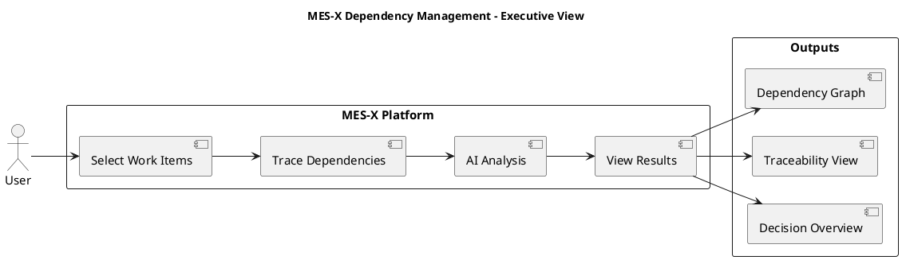
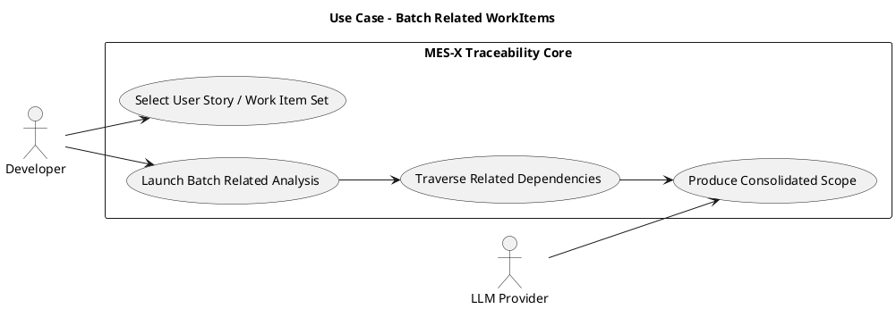
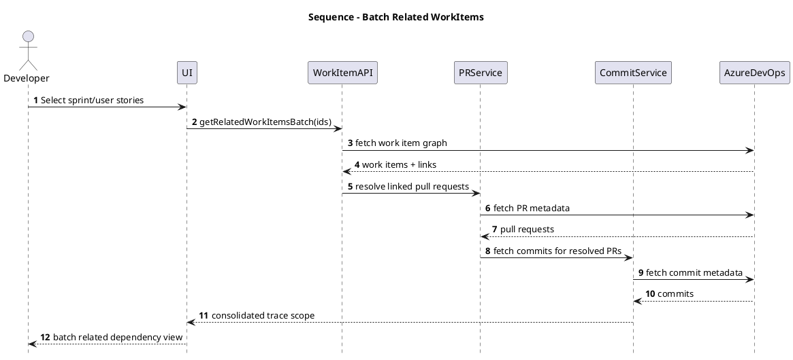
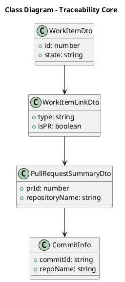
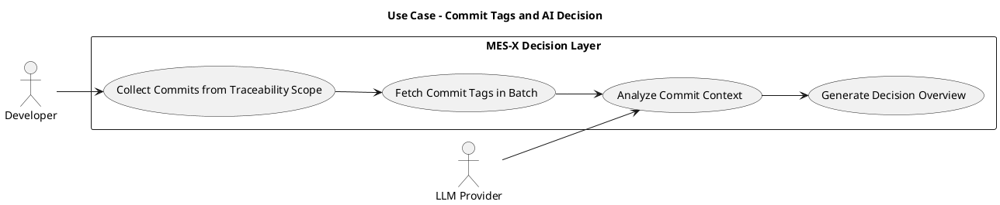
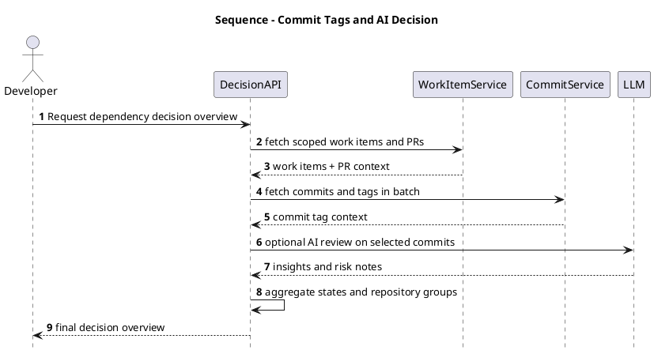
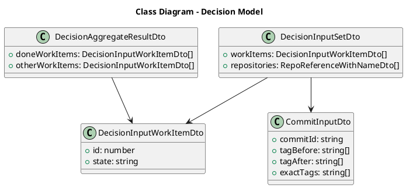

# MES-X Final Defense Presentation (Refactored)

## Presentation Objective
This version is refactored for a clear academic defense narrative:
- Problem to solution progression
- Minimal cognitive load for jury
- Strong logic in Design and Implementation
- Two coherent implementation modules only

---

## Slide 1 — Title
MES-X Dependency Management  
Presented by: Alaeddine Mdalla  
Forvia Informatique Tunisia — MES X.0 Division  
Academic Supervisor: Wafa Boumaiza  
Professional Supervisor: Khemiri Karima

## Slide 2 — Agenda
1. General Context
2. Requirements Analysis
3. Proposed Solution
4. Architecture and Methodology
5. Design and Implementation
6. System Demonstration (Traceability + AI Decision)
7. Conclusion

## Slide 3 — General Context
- Industry 4.0 and smart manufacturing context
- Increasing software dependency complexity
- Need to trace links between work items, pull requests, commits, and tags
- Missing unified dependency visibility for release preparation

## Slide 4 — Host Organization
Forvia:
- Global automotive leader (Faurecia + HELLA)
- Focus on smart manufacturing and software-driven factories

Forvia Informatique Tunisia:
- Software engineering hub
- MES X.0 division
- Microservices-based industrial systems

## Slide 5 — Existing Product Context
- MES ecosystem supports production systems
- Azure DevOps is the primary tracking platform
- Dependencies are implicit and mostly reconstructed manually

## Slide 6 — Existing Solution (Current Logic)
- Developers manually select work items
- Teams trace related pull requests and commits in Azure DevOps
- Dependency graph is reconstructed manually
- Results are copied into spreadsheet tracking

## Slide 7 — Problems of Existing System
- Not scalable
- Error-prone manual linking
- High time consumption
- Fragmented dependency view
- No unified decision support

---

## Slide 8 — Requirements Analysis
Functional and non-functional requirements baseline for automation.

## Slide 9 — Functional Requirements
- Resolve pull requests linked to work items
- Link pull requests to user stories
- Fetch commits and tags
- Build dependency graph
- Generate decision output
- Provide read-only traceability

## Slide 10 — Non-Functional Requirements
- Performance and scalability
- Reliability and fault tolerance
- Security and read-only access
- Maintainability through modular architecture
- Efficient API usage (batching and caching)
- MES architecture compliance

---

## Slide 11 — Proposed Solution
Core idea: automate dependency reconstruction using:
- Work items
- Pull requests
- Commits
- Tags
- Optional LLM analysis

## Slide 12 — Solution Overview (Executive Diagram)

---

## Slide 13 — Agile Methodology
- Scrum methodology
- Azure DevOps for sprint tracking
- Iterative development cycles
- Continuous integration of modules

## Slide 14 — Project Iterations
- Setup and infrastructure
- Work item module
- Pull request module
- Commit module
- Sprint module
- Final integration

## Slide 15 — Architecture and Technologies
Insert full system architecture image.

## Slide 16 — CI/CD Pipeline
Insert CI/CD workflow image.

---

## Slide 17 — Design and Implementation (Section Intro)
Design and Implementation is presented as two logical parts:
1. Batch Related WorkItems
2. Commit Tags Fetch and AI Decision Support

This keeps the technical story linear and strong.

---

## Slide 18 — Part 1: Traceability Core Module
Focus: from user story selection to consolidated dependency scope.

## Slide 19 — Use Case Diagram (Batch Related WorkItems)

## Slide 20 — Sequence Diagram (Batch Related Execution)

## Slide 21 — Class Diagram (Traceability Core)

---

## Slide 22 — Use Case Diagram (Commit Tags and AI Decision)

## Slide 23 — Sequence Diagram (Commit Tags and AI Decision)

## Slide 24 — Class Diagram (Decision Model)

---

## Slide 25 — System Demonstration
Demonstration scenario:
1. Select sprint and batch work items
2. Generate related dependency scope
3. Fetch commit tags and repository context
4. Open decision overview
5. Trigger optional AI commit review

## Slide 26 — Conclusion
- MES-X replaces manual dependency reconstruction with a reproducible pipeline
- Traceability becomes faster, clearer, and decision-oriented
- Two-part logic keeps implementation and operation understandable
- Platform is ready for progressive AI-assisted release analysis
