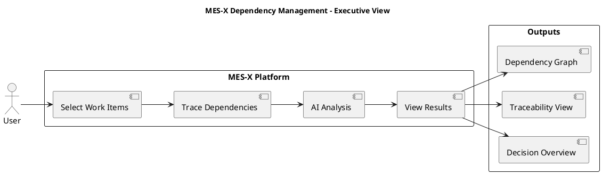
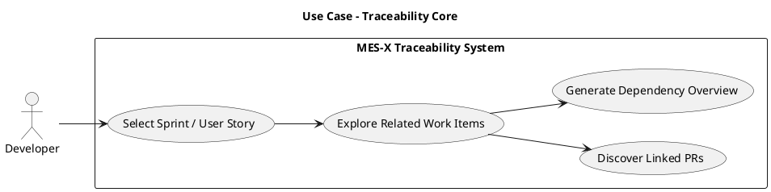
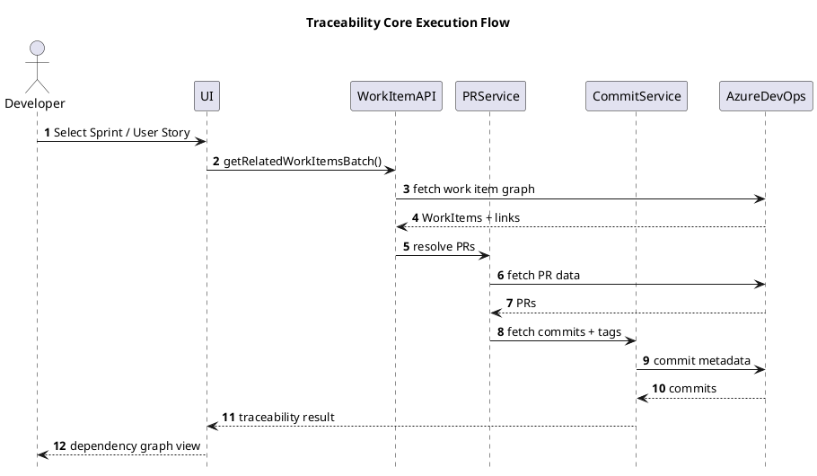
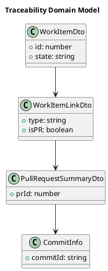
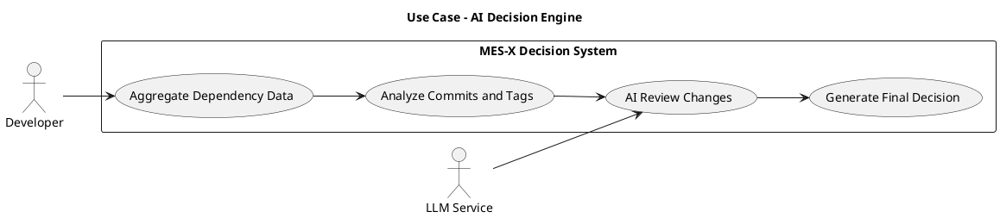
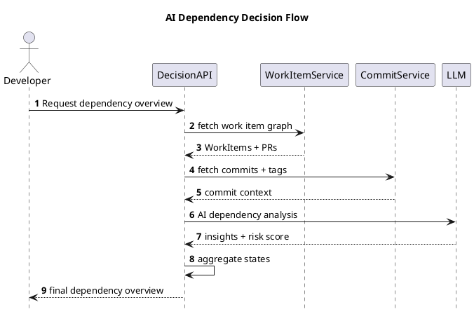
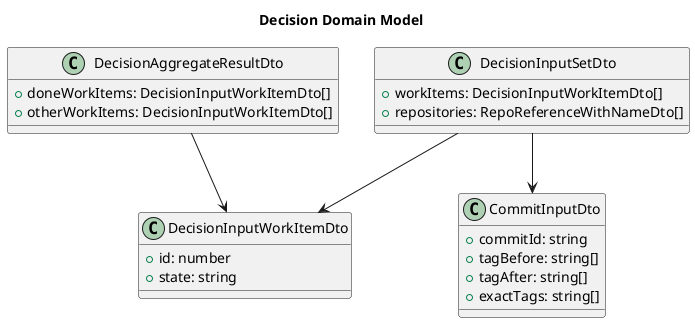

# MES-X Presentation

## Slide 1 - Title
MES-X Dependency Management  
Presented by: Alaeddine Mdalla  
Forvia Informatique Tunisia - MES X.0 Division  
ESPRIT  
Academic Supervisor: Wafa Boumaiza  
Professional Supervisor: Khemiri Karima

---

## Slide 2 - Agenda
- General Context
- Requirements Analysis
- Proposed Solution
- Architecture and Methodology
- Design and Implementation
- System Demonstration (Traceability + AI Decision)
- Conclusion

---

## Slide 3 - General Context
- Industry 4.0 and smart manufacturing context
- Increasing complexity of cross-service dependencies
- Need for traceability across work items, pull requests, and commits
- Lack of unified dependency visibility for release preparation

---

## Slide 4 - Host Organization
Forvia:
- Global automotive leader (Faurecia + HELLA)
- Focus on smart manufacturing and software-driven factories

Forvia Informatique Tunisia:
- Software engineering hub
- MES X.0 division
- Microservices-based industrial systems

---

## Slide 5 - Existing Product Context
- MES ecosystem supports production systems
- Azure DevOps is the main tracking platform
- Dependencies are currently implicit and manually reconstructed

---

## Slide 6 - Existing Solution (Current Logic)
- Developers manually select work items
- Teams trace related PRs and commits in Azure DevOps
- Dependency graph is reconstructed manually
- Results are stored in spreadsheet tracking

---

## Slide 7 - Problems of Existing System
- Not scalable
- Error-prone manual linking
- High time consumption
- Fragmented dependency view
- No unified decision support

---

## Slide 8 - Requirements Analysis
Functional and non-functional requirements baseline.

---

## Slide 9 - Functional Requirements
- Resolve pull requests linked to work items
- Link pull requests to user stories
- Fetch commits and tags
- Build dependency graph
- Generate decision output
- Provide read-only traceability

---

## Slide 10 - Non-Functional Requirements
- Performance and scalability
- Reliability and fault tolerance
- Security and read-only access
- Maintainability with modular architecture
- Efficient API usage through batching and caching
- MES architecture compliance

---

## Slide 11 - Proposed Solution
Core idea: automate dependency reconstruction using:
- Work items
- Pull requests
- Commits
- Tags
- Optional LLM analysis

---

## Slide 12 - Solution Overview (Executive Diagram)

---

## Slide 13 - Agile Methodology
- Scrum methodology
- Azure DevOps for sprint tracking
- Iterative development cycles
- Continuous integration of modules

---

## Slide 14 - Project Iterations
- Setup and infrastructure
- Work item module
- Pull request module
- Commit module
- Sprint module
- Final integration

---

## Slide 15 - Architecture and Technologies
Insert full system architecture image.

---

## Slide 16 - CI/CD Pipeline
Insert CI/CD workflow image.

---

## Slide 17 - Design and Implementation (Section Intro)
This section is intentionally split into two clear logical parts:
1. Traceability Core
2. AI Decision Engine

---

## Slide 18 - Traceability Core Module
Scope:
- Batch related work items
- Pull request discovery
- Commit collection and dependency visibility

---

## Slide 19 - Use Case Diagram (Traceability Core)

---

## Slide 20 - Sequence Diagram (Traceability Execution)

---

## Slide 21 - Class Diagram (Traceability Model)

---

## Slide 22 - Use Case Diagram (AI Decision Engine)

---

## Slide 23 - Sequence Diagram (AI Decision Flow)

---

## Slide 24 - Class Diagram (Decision Model)

---

## Slide 25 - UI Screen Example (Traceability Core)
Use case satisfaction:
- Matches "Select Sprint / User Story"
- Matches "Explore Related Work Items"
- Matches "Generate Dependency Overview"

Suggested screen insert:

Alternative screen:

---

## Slide 26 - UI Screen Example (AI Decision Engine)
Use case satisfaction:
- Matches "Aggregate Dependency Data"
- Matches "Analyze Commits and Tags"
- Matches "Generate Final Decision"

Suggested screen insert:

Alternative screen:

---

## Slide 27 - System Demonstration
Demo scenario:
1. Select sprint and batch work items
2. Generate related dependency scope
3. Fetch commit tags and repository context
4. Open decision overview
5. Trigger optional AI review

---

## Slide 28 - Conclusion
- MES-X replaces manual dependency reconstruction with a reproducible pipeline
- Traceability becomes faster, clearer, and decision-oriented
- The two-part design keeps implementation logic easy to explain
- The platform is ready for progressive AI-assisted release analysis
